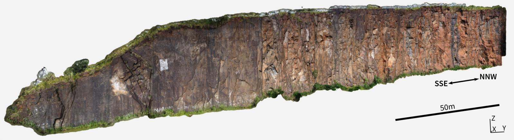
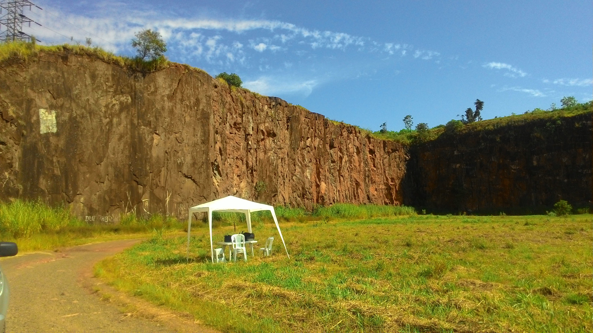
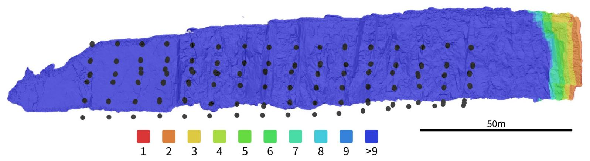

<!-- Improved compatibility of back to top link: See: https://github.com/othneildrew/Best-README-Template/pull/73 -->

<!--
*** Thanks for checking out the Best-README-Template. If you have a suggestion
*** that would make this better, please fork the repo and create a pull request
*** or simply open an issue with the tag "enhancement".
*** Don't forget to give the project a star!
*** Thanks again! Now go create something AMAZING! :D
-->

<!-- PROJECT SHIELDS -->
<!--
*** I'm using markdown "reference style" links for readability.
*** Reference links are enclosed in brackets [ ] instead of parentheses ( ).
*** See the bottom of this document for the declaration of the reference variables
*** for contributors-url, forks-url, etc. This is an optional, concise syntax you may use.
*** https://www.markdownguide.org/basic-syntax/#reference-style-links
-->
[![Contributors][contributors-shield]][contributors-url]
[![Forks][forks-shield]][forks-url]
[![Stargazers][stars-shield]][stars-url]
[![GPL-3.0 License][license-shield]][license-url]

<!-- PROJECT LOGO -->
 

  
 
  <h3 align="center">Digital Outcrop Model</h3>
  <h1 align="center">Jardim Garcia Quarry</h3>

<!-- ABOUT THE PROJECT -->
## About The Project

Situated at the outskirts of Campinas City (São Paulo State, southeastern Brazil), the Jardim Garcia quarry is composed of mafic intrusive rocks from Serra Geral Formation (Cretaceous, Paraná Basin). It is deactivated and used as a recreational area for activities such as rock climbing and aeromodeling. 
This project focused on create a Digital Outcrop Model of the west side of the quarry, a ∼25 m high and ∼200 m long SSE-NNW rock wall. 
For georeferencing the final 3D model, climbing anchors were surveyed by irradiation from a total station located in an open traverse. The traverse coordinates were obtained by geodetic GNSS post-processing.

  
  <h4 align="center">Overview of the Jardim Garcia quarry wall.</h4>

Because of the dimensions of the outcrop, we developed a workflow to program autonomous RPA missions designed to acquire images of vertical surfaces with the desired parameters of distance to target and overlap, using the Litchi App. The layout of the flight lines and waypoints resulted in an image overlap greater than nine photos for almost all the wall area.

  
  <h4 align="center">Overview of image overlap on the processed DOM.</h4>

### Data

Here you can find:
* `LO_LO_points.ply` : A dense point cloud processed using Agisoft Metashape with align and densification parameters set to Low;
* `20m_LO_LO.pdf` : Processing report generated by Agisoft Metashape;

## Additional data

You can find the original image set at [Geonadir](https://geonadir.com/) and the full resolution 3D point cloud at [Zenodo](https://zenodo.org/).

### Built With

* [![Metashape][Metashape.badge]][Metashape-url]

<!-- PUBLICATIONS -->
## Publications

This dataset was use on the following publications:

* Conference paper @XIX Brazilian Symposium on Remote Sensing : [https://proceedings.science/sbsr-2019/papers/semi-automatic-uav-based-sfm-survey-of-vertical-surfaces](https://proceedings.science/sbsr-2019/papers/semi-automatic-uav-based-sfm-survey-of-vertical-surfaces) 
* Conference paper @14th International Congress on Rock Mechanics (ISRM) : [Rock Mechanics for Natural Resources and Infrastructure Development - Full Papers](https://www.routledge.com/Rock-Mechanics-for-Natural-Resources-and-Infrastructure-Development---Full/Fontoura-Rocca-Mendoza/p/book/9780367823177)
* [Camila Duelis Viana](https://github.com/cdviana) PhD Thesis : [https://www.teses.usp.br/teses/disponiveis/44/44137/tde-18012022-122057/pt-br.php](https://www.teses.usp.br/teses/disponiveis/44/44137/tde-18012022-122057/pt-br.php)

<!-- LICENSE -->
## License

Distributed under the GPL-3.0 License. See `LICENSE.txt` for more information.

<!-- CONTACT -->
## Contact

SPAMLab - [@SPAMLab Site](https://spamlab.github.io/) - [@SPAMLab Instagam](https://www.instagram.com/spamlab.iee/)

Project Link: [https://spamlab.github.io/jd-garcia-quarry](https://spamlab.github.io/jd-garcia-quarry)

<!-- ACKNOWLEDGMENTS -->
## Acknowledgments

This project was supported by FAPESP (grants #2016/06628-0, # 2019/26568-0) and CNPq (grant # 311209/2021-1).

(<a href="#readme-top">back to top</a>)

<!-- MARKDOWN LINKS & IMAGES -->
<!-- https://www.markdownguide.org/basic-syntax/#reference-style-links -->
[contributors-shield]: https://img.shields.io/github/contributors/othneildrew/Best-README-Template.svg?style=for-the-badge
[contributors-url]: https://github.com/othneildrew/Best-README-Template/graphs/contributors
[forks-shield]: https://img.shields.io/github/forks/othneildrew/Best-README-Template.svg?style=for-the-badge
[forks-url]: https://github.com/othneildrew/Best-README-Template/network/members
[stars-shield]: https://img.shields.io/github/stars/othneildrew/Best-README-Template.svg?style=for-the-badge
[stars-url]: https://github.com/othneildrew/Best-README-Template/stargazers
[issues-shield]: https://img.shields.io/github/issues/othneildrew/Best-README-Template.svg?style=for-the-badge
[issues-url]: https://github.com/othneildrew/Best-README-Template/issues
[license-shield]: https://img.shields.io/github/license/cdviana/jd-garcia-quarry.svg?style=for-the-badge
[license-url]: https://github.com/cdviana/jd-garcia-quarry/blob/main/LICENSE
[linkedin-shield]: https://img.shields.io/badge/-LinkedIn-black.svg?style=for-the-badge&logo=linkedin&colorB=555
[linkedin-url]: https://linkedin.com/in/othneildrew
[product-screenshot]: images/screenshot.png
[Metashape.badge]: https://img.shields.io/badge/PROCESSING-Agisoft%20Metashape-blue
[Metashape-url]: https://www.agisoft.com/
